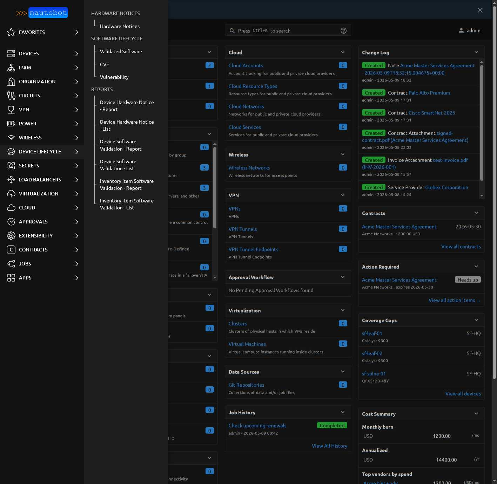
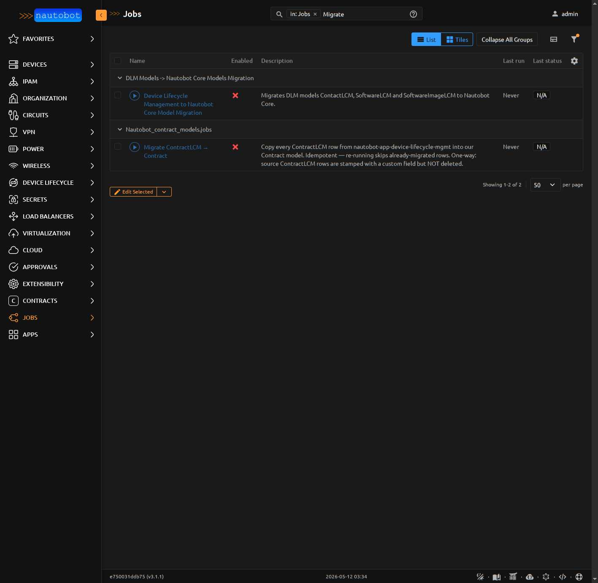
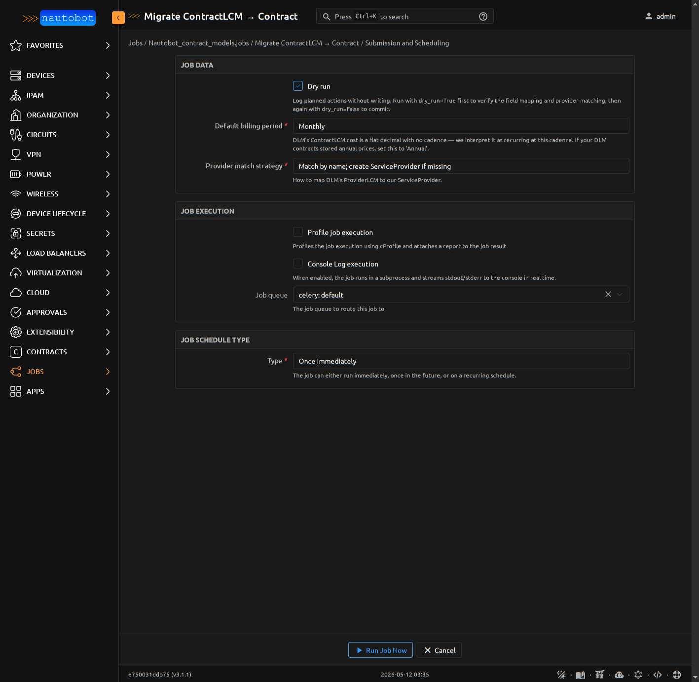
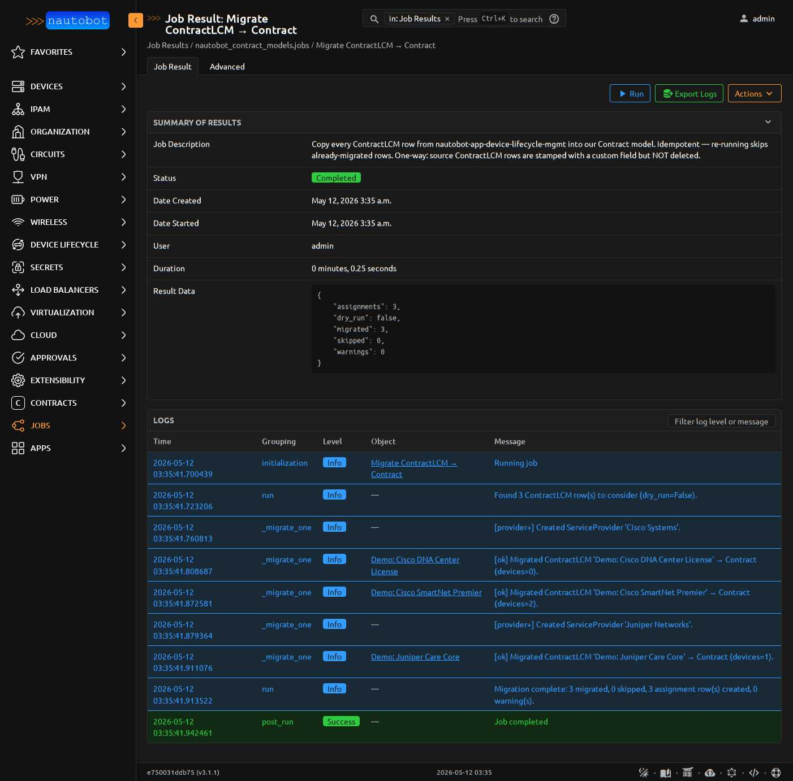
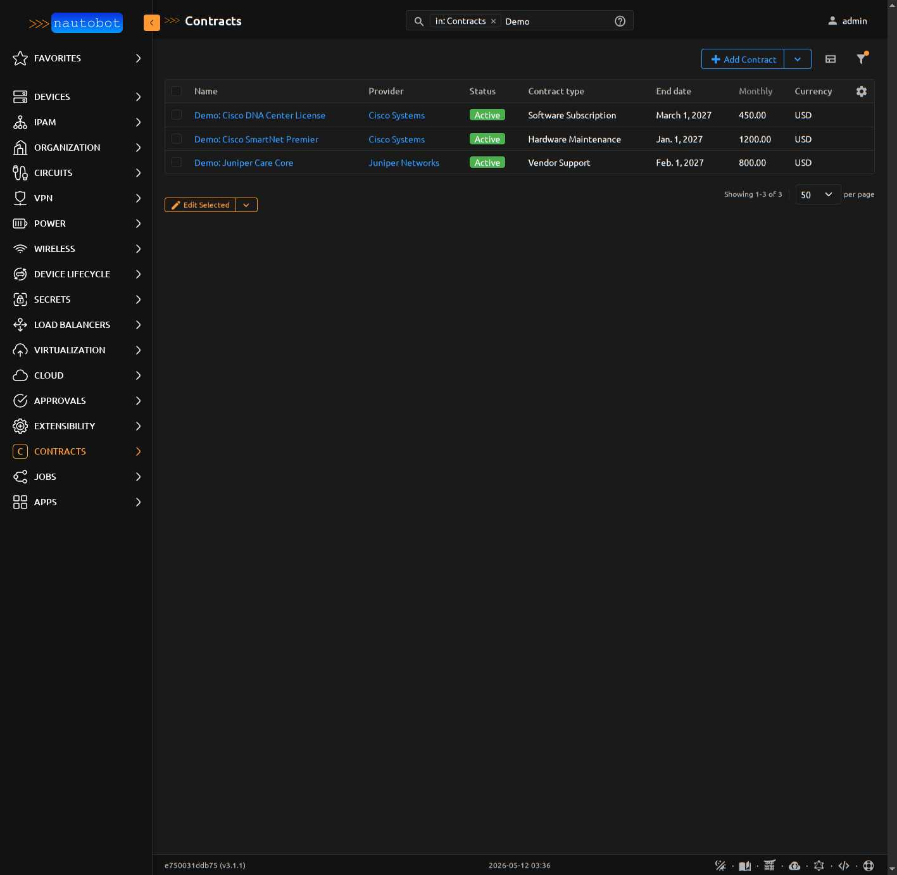
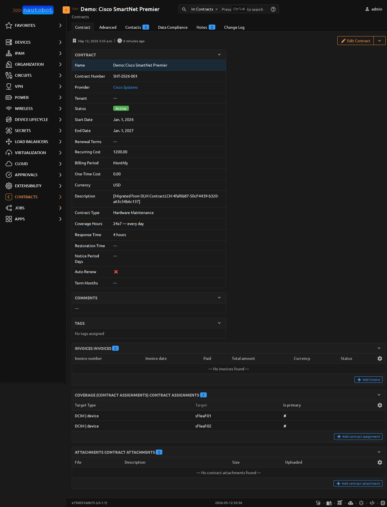
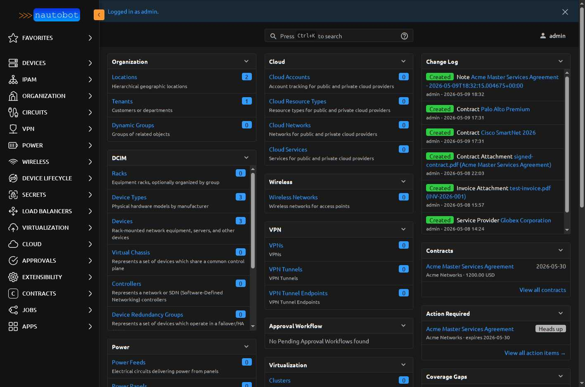

# Coexistence with `nautobot-app-device-lifecycle`

`nautobot-app-device-lifecycle-mgmt` (DLM) ships a `ContractLCM` model that overlaps with our `Contract`. Since v2026.5.11 the two plugins coexist without colliding on Django's `Status` reverse accessor (the original `fields.E304` collision is gone). v2026.5.12 adds two opt-in features for operators who want our `Contract` to be **the** canonical contracts surface:

1. A **one-way idempotent migration Job** that copies every `ContractLCM` row into our `Contract` model.
2. An **opt-in nav-hide flag** that removes DLM's `Contracts` sidebar group so operators see one canonical contracts surface — ours.

DLM's data, URLs, REST API, and other nav groups (Hardware Notices, Software Lifecycle, Reports) remain untouched throughout.

## Why this is opt-in

Operators with established DLM-side scripts or external integrations may rely on DLM's `Contracts` URLs and REST endpoints. We never touch those. The migration is a *copy* — your `ContractLCM` rows remain in DLM's database, just stamped with a custom field marking them as migrated. You enable each piece (the Job, the nav-hide flag) when you're ready.

The nav-hide flag works by surgically removing DLM's `Contracts` group from the **Device Lifecycle** sidebar tab. All other DLM nav groups stay.



## Before you start

- Confirm both apps are installed: `nautobot-server shell -c "from django.apps import apps; print(apps.is_installed('nautobot_contract_models'), apps.is_installed('nautobot_device_lifecycle_mgmt'))"` should print `True True`.
- Confirm `nautobot-server check` exits 0 with both apps loaded. If it doesn't, you're missing the Phase 18 fix — upgrade to `nautobot-contract-models>=2026.5.11` first.

## Step 1 — Enable the migration Job

Newly-discovered Jobs ship **disabled** in Nautobot 3.x. Visit *Apps → Jobs* and find the **Migrate ContractLCM → Contract** entry under the `Contracts` group. Note that it sits as a sibling to DLM's own `DLM Models → Nautobot Core Models Migration` Job — DLM's migration explicitly skips `ContractLCM` because Nautobot core has no Contract destination model, so ours fills the gap.



Click the row → **Edit** → check **Enabled** → **Save**.

## Step 2 — Run with `dry_run=True` first

Click **Run** on the Job. The auto-generated form has three operator-facing variables:

- `Dry run` (default **on**) — log planned actions without writing.
- `Default billing period` (default Monthly) — DLM's `ContractLCM.cost` is a flat decimal with no cadence; we interpret it as recurring at this cadence. Set to `Annual` if your DLM contracts stored annual prices.
- `Provider match strategy` — `Match by name; create ServiceProvider if missing` (default) or `Match by name; skip the contract if no ServiceProvider matches`.



Leave `Dry run` checked, click **Run Job Now**, then read the JobResult page:

- **Counts**: `migrated`, `skipped`, `assignments` (devices that will become `ContractAssignment` rows), `warnings`.
- Per-row `[dry-run] Would migrate…` log lines.
- `[unmapped]` warnings on rows whose `support_level` or `contract_type` free-text didn't match any known pattern. Fix the source values in DLM's UI if you want them mapped, or accept that those fields land blank in our model.

## Step 3 — Commit the migration

When the dry-run report looks right, return to the run form, **uncheck Dry run**, and click Run Job Now again. The result page shows the same fields, but `dry_run: false` and the counts now reflect actual database writes:



Each row in the log is one of:

- `[provider+] Created ServiceProvider 'X'` — auto-created because the strategy was `by_name` (the default) and no match existed.
- `[ok] Migrated ContractLCM 'Y' → Contract (devices=N)` — successful row migration; the `(devices=N)` count is the number of `ContractAssignment` rows created from `ContractLCM.devices` M2M.
- `[unmapped] ContractLCM 'Z' support_level='...' — leaving coverage_hours/response_time blank` — best-effort regex didn't match; field left blank.
- `[skip] …` — a row was skipped for some reason (missing start/end, no provider, etc.).

The Job is **idempotent**. Each migrated `ContractLCM` is stamped with a Nautobot custom field `migrated_to_contract_models=True`; re-running the Job excludes already-stamped rows. Same idiom DLM's own `model_migration.py` uses.

The Job is **one-way**. Source `ContractLCM` rows are stamped but **never deleted**. Delete them yourself from DLM's UI when you're confident the migration is correct.

## Step 4 — Verify in our Contracts list

Visit `/plugins/contracts/contracts/` and you'll see the migrated rows alongside any pre-existing Contracts:



Click into any migrated contract to verify the full field mapping. The Description field carries an audit breadcrumb (`[Migrated from DLM ContractLCM <uuid>]`) so you can trace back to the source row, and the COVERAGE panel shows the device M2M converted to polymorphic `ContractAssignment` rows:



## Step 5 — (Optional) Hide DLM's Contracts sidebar

Once the data is in our model, you can optionally remove DLM's Contracts/Vendors sub-items from the Device Lifecycle sidebar. In `nautobot_config.py`:

```python
PLUGINS_CONFIG = {
    "nautobot_contract_models": {
        "hide_dlm_contracts_nav": True,
    },
}
```

Restart Nautobot. DLM's Contracts / Vendors sub-items disappear from the **Device Lifecycle** sidebar; Hardware Notices, Software Lifecycle, and Reports survive. DLM's URLs (`/plugins/nautobot-device-lifecycle-mgmt/contract/…`) keep resolving — scripts or bookmarks hitting them aren't affected, only the sidebar nav is.

The home dashboard now shows only our contracts surface as the canonical place for contract work:



## Field mapping reference

| DLM `ContractLCM` field | Our `Contract` field | Notes |
|---|---|---|
| `name` | `name` | direct |
| `provider` (ProviderLCM) | `provider` (ServiceProvider) | matched by name; auto-created with the default `by_name` strategy |
| `status` (StatusField) | `status` (StatusField) | falls back to "Active" if DLM's status isn't valid for our Contract |
| `number` | `contract_number` | direct |
| `start` | `start_date` | direct |
| `end` | `end_date` | direct |
| `cost` | `recurring_cost` | interpreted per the `default_billing_period` Job var |
| `currency` | `currency` | direct; default `USD` if blank |
| `support_level` (free-text) | `coverage_hours` + `response_time` (enums) | best-effort regex match |
| `contract_type` (free-text) | `contract_type` (enum) | best-effort regex match |
| `devices` (M2M) | `ContractAssignment` rows | one per device, `content_type=dcim.Device` |
| `comments` | `comments` | direct |

Best-effort regex patterns recognize phrases like `24x7`, `8x5xNBD`, `4-hour response`, `NBD`, `business hours`, `Hardware Maintenance`, `Software Subscription`, `Vendor Support`, `Managed Services`, etc. Unmappable values warn-and-leave-blank — fix the source string in DLM, re-run the Job (it'll skip already-stamped rows so unmapped fields stay blank), or hand-edit in our UI.

## Caveats

- **DLM's `DeviceContractLCM` template-content panel** (the contracts table injected into the Device detail page) is not affected by the nav-hide flag. Operators may still see DLM's contracts table on a Device's detail page even after migration. Suppressing it cleanly requires either monkey-patching DLM or asking upstream for a config flag.
- **No URL redirect.** DLM's `/plugins/nautobot-device-lifecycle-mgmt/contract/…` URLs remain reachable; we don't 301-redirect them. Operators with bookmarks need to update manually, but external scripts and REST API consumers keep working.
- **Two-way sync isn't supported.** Updates to our `Contract` do NOT propagate back to `ContractLCM`. After migration, treat our model as the source of truth.
- **Deletion stays operator-controlled.** Migrated `ContractLCM` rows remain in DLM's database with the custom-field marker set. Delete them from DLM's UI when you're comfortable.
