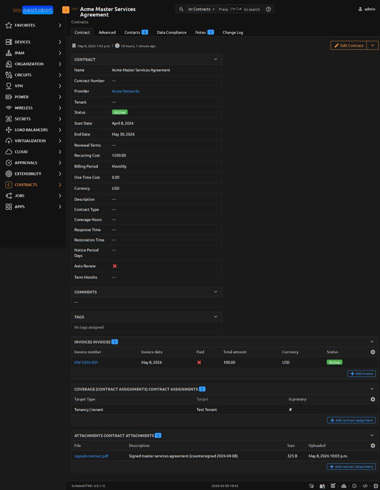

# Getting Started

This guide walks through the typical first-day workflow: install the app, create a service provider, attach a contract to a Device, and confirm the data shows up on the dashboard panels.

## Prerequisites

- Nautobot 3.0+ installed and running
- The app installed (see [Install](../admin/install.md))
- A user account with `nautobot_contract_models.add_*` permissions

## Step 1 — Create a Service Provider

Navigate to **Contracts → Service Providers → Add**. At minimum, fill in the name (the natural key). Optional fields like `account_number`, `portal_url`, and `support_email` are useful but not required.

## Step 2 — Create a Contract

Navigate to **Contracts → Contracts → Add**. The required fields are:

| Field | Notes |
|---|---|
| `name` | Free-text; usually the vendor's contract title |
| `provider` | The ServiceProvider you created in Step 1 |
| `status` | Active / Expired / Cancelled / Pending (registered at install) |
| `start_date` | When coverage starts |
| `end_date` | When coverage ends — drives the renewal calendar |

Recommended fields:

- `recurring_cost` — periodic cost in `currency`; combine with `billing_period` so cost analytics can normalize
- `billing_period` — `monthly` / `quarterly` / `semiannual` / `annual` / `one_time` (drives burn-rate normalization)
- `currency` — ISO 4217 (USD, EUR, GBP). The plugin never sums across currencies
- `notice_period_days` — used by the renewal severity rubric to escalate alerts inside the notice window
- `auto_renew` — boolean; flips the priority to URGENT when inside the notice window
- `term_months` — original term length, drives `total_contract_value` calculations

## Step 3 — Attach the Contract to a Device (or any Nautobot object)

Open the contract detail page and click **Add contract assignment** in the Coverage panel. Select the target type (Device, Tenant, Location, Circuit, VirtualMachine, etc.) and the specific object.

The transitive coverage helper walks Tenant → Location → Rack → Device, so a Tenant-level assignment automatically covers every Device under that Tenant.

## Step 4 — Verify on the home dashboard

Navigate to the Nautobot home page. Within seconds you should see your contract appear in:

- **Contracts** panel (per-contract row)
- **Cost Summary** panel (your contract's cost contributing to monthly burn)
- **Renewal Forecast** panel (contributing to whatever window your end_date lands in)

If the contract is within 60 days of expiry, it will also show in the **Action Required** panel with a priority tier.

## Step 5 — Schedule the Jobs

Navigate to **Jobs**. Find these jobs under the *Contracts* group and enable them:

- **Check upcoming renewals** — daily / weekly
- **Find devices without contract coverage** — daily / weekly
- **Capture cost history snapshot** — weekly (feeds the Cost History viz)
- **Detect cost anomalies** — weekly (alerts when burn rate jumps)
- **Monthly cost report** — weekly or monthly (writes summary to JobLogEntry)

For each, set `Enabled` and `Has Sensitive Variables` appropriately, then add a recurring schedule via **Jobs → Scheduled Jobs → Add**.

## Step 6 — Bulk-load existing contracts (optional)

If you're migrating from a spreadsheet, paste the CSV into **Contracts → Contracts → Import**. A working sample lives at `development/sample-data/contracts.csv` in the repo. Format quirks (FK lookups by name, boolean literals, date format) are documented in `development/sample-data/README.md`.
