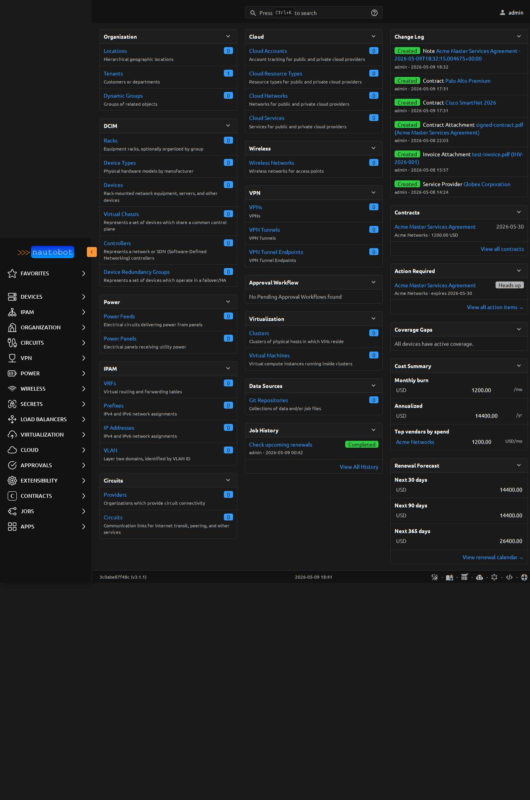

# App Overview

This document provides an overview of the App, including critical information and considerations for applying it to your Nautobot environment.

!!! note
    Throughout this documentation, the terms "app" and "plugin" are used interchangeably.

## Description

**Nautobot Contract Models** adds first-class Django ORM models to Nautobot for tracking vendor contracts, invoices, service providers, file attachments, and the cost analytics built on top of them. It is inspired by the NetBox `netbox-contract` plugin, but re-architected for Nautobot 3.x conventions (Status framework, Tenant, ChangeLog, the Job framework, the UI Component framework).

The plugin's primary contribution is **data and queries** — not an integration with an external system. Contract data lives in Nautobot's own database; this is not a sync plugin.

## Audience

- Network and systems engineers who want vendor support contracts visible alongside the devices, circuits, and tenants those contracts cover
- Operators tracking renewals, notice windows, and budget exposure across vendors and currencies
- Procurement teams who want machine-readable cost data behind the same UI engineers use day-to-day

## Authors and Maintainers

- Ryan Malloy <ryan@supported.systems>

## Nautobot Features Used

- Custom Fields
- Custom Links
- Custom Validators
- Export Templates
- GraphQL
- Relationships
- Statuses
- Tags
- Webhooks
- Notes (auto-wired by Nautobot)
- Jobs (4 jobs registered in this app)
- Home dashboard panels (4 added by this app)

## Models

| Model | Purpose |
|---|---|
| `ServiceProvider` | The vendor / counterparty on a contract |
| `Contract` | The master agreement with dates, costs, SLA structure |
| `Invoice` | One billing line on a contract |
| `ContractAssignment` | Generic-FK link between a Contract and any Nautobot object (Device, Circuit, VirtualMachine, …) |
| `ContractAttachment` | File upload attached to a Contract (signed PDFs, etc.) |
| `InvoiceAttachment` | File upload attached to an Invoice |
| `CostSnapshot` | Point-in-time fleet-cost telemetry |

## Reports / Dashboards

The app contributes four home dashboard panels:

- **Action Required** — top contracts in their notice window or imminent (Phase 12)
- **Coverage Gaps** — Devices without active contract coverage (transitive walk through Tenant / Location)
- **Cost Summary** — current monthly burn rate per currency, annualized, top vendors
- **Renewal Forecast** — total renewal cost in 30 / 90 / 365 day windows

Plus three dedicated report pages:

- **Action Required** at `/plugins/contracts/reports/action-required/`
- **Renewal Calendar** at `/plugins/contracts/reports/renewal-calendar/`
- **Cost History** at `/plugins/contracts/reports/cost-history/`

