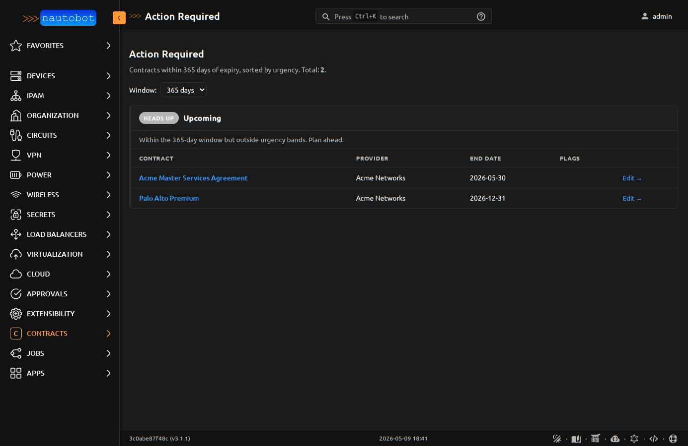
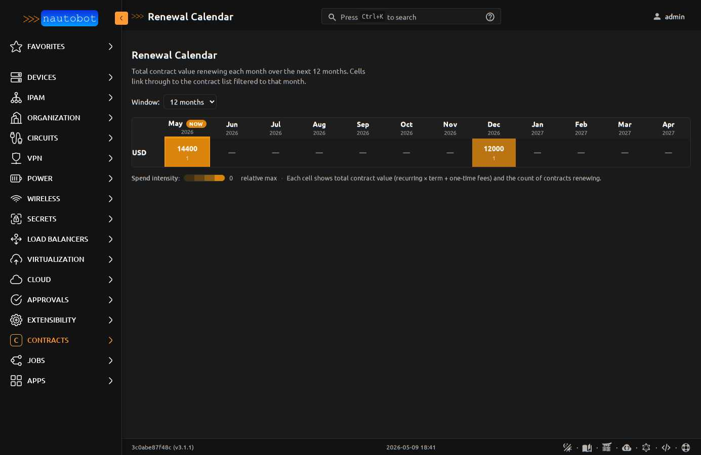
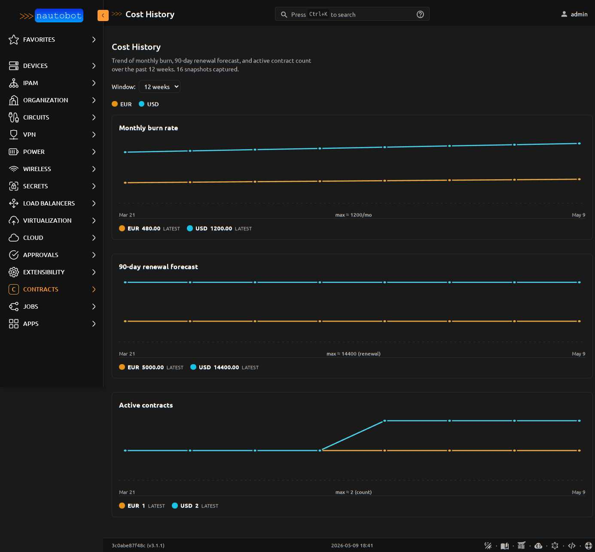

# Using the App

This page walks through the four operator-facing surfaces the plugin contributes beyond the standard CRUD list/detail views.

## Action Required

`/plugins/contracts/reports/action-required/` is a single page that answers "what do I need to do this week to avoid a renewal surprise?".

Contracts are bucketed into three priority tiers driven by a centralized rubric in `priority.action_priority()`:

- **URGENT** — `auto_renew=True` AND inside the notice window. The contract auto-renews on un-renegotiated terms unless action is taken.
- **WARNING** — within 7 days of `end_date`, OR inside the notice window without auto-renew. Lapse means termination.
- **HEADS UP** — within the configured window but outside urgency bands.

Each row links to the contract detail page and to a direct edit shortcut. The window selector ranges from 14 to 365 days.

The same rubric drives the **Action Required** home dashboard panel and the `Check upcoming renewals` Job's severity classification — one source of truth keeps the three surfaces aligned.

## Renewal Calendar

`/plugins/contracts/reports/renewal-calendar/` is a forward-looking, month-by-month grid of contract renewals with cost density encoded as amber saturation. Operators see "March is a $400k month" at a glance and can click any cell to drill into the contract list filtered to that month + currency.

Key design properties:

- **Per-currency rows.** No FX conversion. USD and EUR contracts appear on separate rows.
- **Single-hue saturation scale.** Pale wash for light months, saturated for heavy months. Color encodes magnitude; numeric values are always visible.
- **"NOW" badge** on the current month's column header, plus amber rails on data cells in the current column. Two redundant signals so the indicator works in forced-colors mode and on printers.
- **Click-through.** Cells link to `/contracts/?end_date__year=YYYY&end_date__month=MM&currency=XXX` so the calendar is a starting point for deeper investigation.
- **Window selector** (3/6/12/24/36 months).
- **Print-friendly** — `@media print` strips colors and adds borders for budget meetings.

## Cost History

`/plugins/contracts/reports/cost-history/` renders three time-series line charts (monthly burn, 90-day renewal forecast, active contract count), one line per currency, over a configurable window (4/12/26/52 weeks). Inline SVG — no JS chart library, prints natively, dark-mode aware.

Data comes from the `CostSnapshot` model. Schedule the **Capture cost history snapshot** Job weekly to feed the trend; on a fresh install the page renders an empty state pointing at the Job.

The **Detect cost anomalies** Job (also under *Contracts*) compares this week's snapshots to a configurable baseline (default 4 weeks ago) and emits a `WARNING`-level JobLogEntry whenever burn rate or 90-day renewal forecast moves by more than `threshold_pct` (default 20%) per currency. Wire a webhook to JobLogEntry creation to route into Slack / email / a ticket.

## Cost Summary + Renewal Forecast Panels

The home dashboard contributes two cost panels (in addition to Action Required and Coverage Gaps):

- **Cost Summary** — current monthly burn rate per currency, annualized, top 5 vendors by spend
- **Renewal Forecast** — total renewal cost in 30 / 90 / 365 day windows, per currency

Both panels group by `Contract.currency` and never sum across currencies (the plugin doesn't do FX in v1).

## Coverage Gaps

Devices with no active contract coverage — direct OR transitive (via Tenant, Location, Rack, etc.) — are surfaced in two ways:

- **Coverage Gaps** home dashboard panel showing the first 10 uncovered devices with location + tenant context
- **Find devices without contract coverage** Job that walks every Device and writes one `WARNING` log line per uncovered device, plus an INFO summary

The transitive coverage helper (`helpers.coverage_assignments`) walks `(self, tenant, location, rack, device)` ancestry. A Tenant-level contract assignment automatically covers every Device under that Tenant — operators don't have to attach contracts to individual devices.
