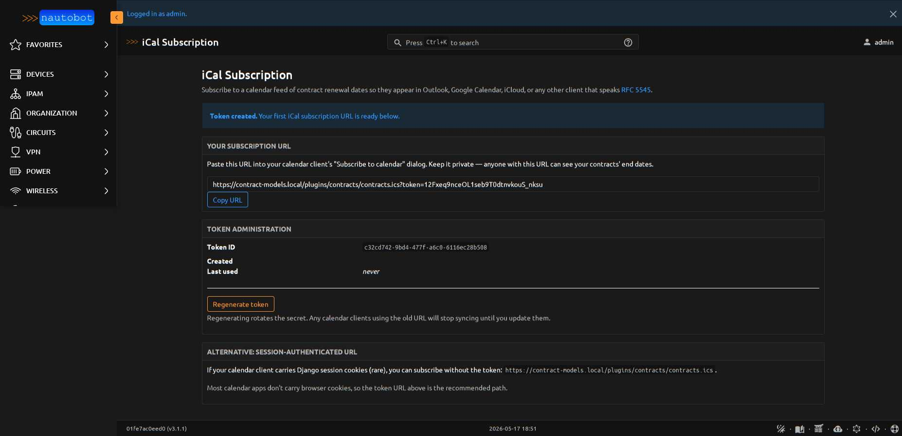
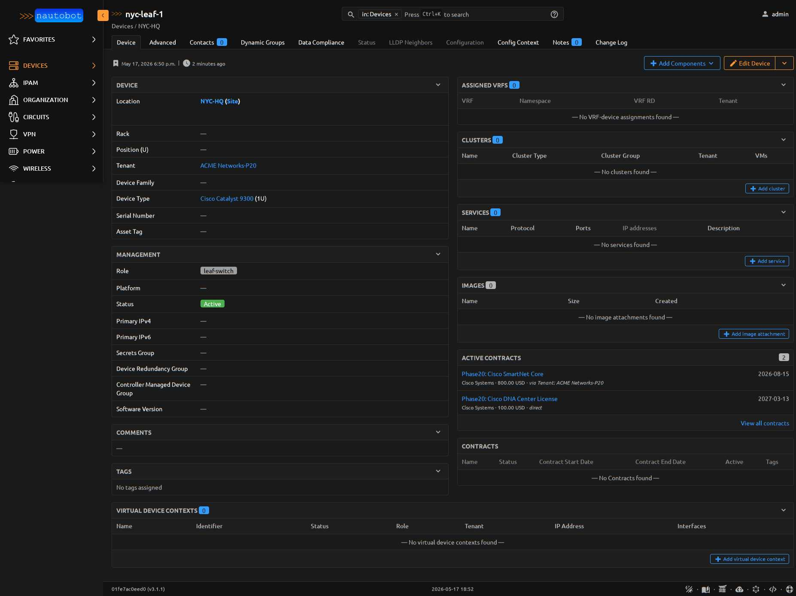
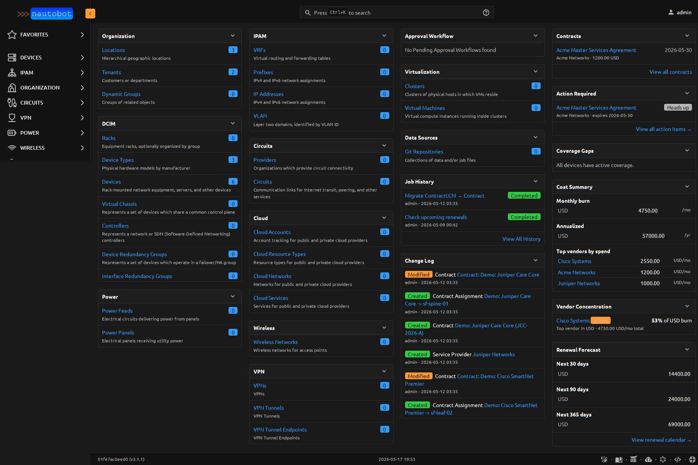
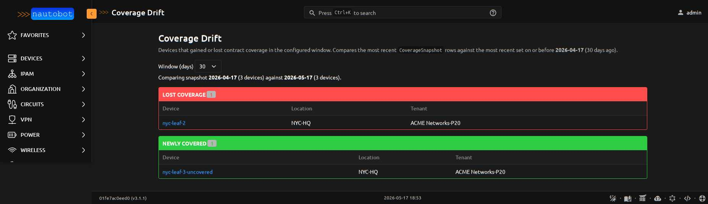

# Using the App

This page walks through the operator-facing surfaces the plugin contributes beyond the standard CRUD list/detail views.

## Action Required

`/plugins/contracts/reports/action-required/` is a single page that answers "what do I need to do this week to avoid a renewal surprise?".

Contracts are bucketed into three priority tiers driven by a centralized rubric in `priority.action_priority()`:

- **URGENT** — `auto_renew=True` AND inside the notice window. The contract auto-renews on un-renegotiated terms unless action is taken.
- **WARNING** — within 7 days of `end_date`, OR inside the notice window without auto-renew. Lapse means termination.
- **HEADS UP** — within the configured window but outside urgency bands.

Each row links to the contract detail page and to a direct edit shortcut. The window selector ranges from 14 to 365 days.

The same rubric drives the **Action Required** home dashboard panel and the `Check upcoming renewals` Job's severity classification — one source of truth keeps the three surfaces aligned.

## Renewal Calendar

`/plugins/contracts/reports/renewal-calendar/` is a forward-looking, month-by-month grid of contract renewals with cost density encoded as amber saturation. Operators see "March is a $400k month" at a glance and can click any cell to drill into the contract list filtered to that month + currency.

Key design properties:

- **Per-currency rows.** No FX conversion. USD and EUR contracts appear on separate rows.
- **Single-hue saturation scale.** Pale wash for light months, saturated for heavy months. Color encodes magnitude; numeric values are always visible.
- **"NOW" badge** on the current month's column header, plus amber rails on data cells in the current column. Two redundant signals so the indicator works in forced-colors mode and on printers.
- **Click-through.** Cells link to `/contracts/?end_date__year=YYYY&end_date__month=MM&currency=XXX` so the calendar is a starting point for deeper investigation.
- **Window selector** (3/6/12/24/36 months).
- **Print-friendly** — `@media print` strips colors and adds borders for budget meetings.

## Cost History

`/plugins/contracts/reports/cost-history/` renders three time-series line charts (monthly burn, 90-day renewal forecast, active contract count), one line per currency, over a configurable window (4/12/26/52 weeks). Inline SVG — no JS chart library, prints natively, dark-mode aware.

Data comes from the `CostSnapshot` model. Schedule the **Capture cost history snapshot** Job weekly to feed the trend; on a fresh install the page renders an empty state pointing at the Job.

The **Detect cost anomalies** Job (also under *Contracts*) compares this week's snapshots to a configurable baseline (default 4 weeks ago) and emits a `WARNING`-level JobLogEntry whenever burn rate or 90-day renewal forecast moves by more than `threshold_pct` (default 20%) per currency. Wire a webhook to JobLogEntry creation to route into Slack / email / a ticket.

## Cost Summary + Renewal Forecast Panels

The home dashboard contributes two cost panels (in addition to Action Required and Coverage Gaps):

- **Cost Summary** — current monthly burn rate per currency, annualized, top 5 vendors by spend
- **Renewal Forecast** — total renewal cost in 30 / 90 / 365 day windows, per currency

Both panels group by `Contract.currency` and never sum across currencies (the plugin doesn't do FX in v1).

## Coverage Gaps

Devices with no active contract coverage — direct OR transitive (via Tenant, Location, Rack, etc.) — are surfaced in two ways:

- **Coverage Gaps** home dashboard panel showing the first 10 uncovered devices with location + tenant context
- **Find devices without contract coverage** Job that walks every Device and writes one `WARNING` log line per uncovered device, plus an INFO summary

The transitive coverage helper (`helpers.coverage_assignments`) walks `(self, tenant, location, rack, device)` ancestry. A Tenant-level contract assignment automatically covers every Device under that Tenant — operators don't have to attach contracts to individual devices.

## iCal Calendar Subscription

`/plugins/contracts/ical-token/` generates a per-user URL that subscribes operators' personal calendar apps (Outlook, Google Calendar, iCloud, anything that speaks RFC 5545) to contract end dates. Renewal deadlines appear next to actual meetings — no more "did the SmartNet contract lapse last week?" emails.

The page auto-creates a 32-character URL-safe token on first visit and shows the full subscription URL with a copy-to-clipboard button. Token administration has a regenerate button (revokes the previous URL and rotates the secret). The feed includes a VEVENT per active contract's `end_date`, plus a VEVENT for `start_date` when the contract hasn't yet begun (newly-signed contracts show as upcoming events). Date-only events — no timezone gymnastics; all-day in every calendar client.

**Auth**: session OR `?token=<secret>` URL param. Calendar apps that don't carry browser cookies (which is most of them) use the token URL. The token grants read-only access to contract end dates — it does NOT grant general account access. Treat the URL like a password; regenerate to revoke.

## Device-detail Active Contracts panel

Every Device detail page in Nautobot gets an **Active Contracts** side panel listing the contracts covering that device — direct *or* transitive (via Tenant, Location, Rack, parent Device).

The "Source" column makes the coverage path explicit:

- `direct` — `ContractAssignment.content_type == dcim.device, object_id == <this device>`
- `via Tenant: ACME Networks-P20` — assignment is on the device's tenant
- `via Location: NYC-HQ` — assignment is on the device's location

Operators investigating a Device issue see contract coverage *where they already are*, without leaving the page. The panel cap is 10 contracts; operators with more drill into the full Contracts list filtered by device.

## Vendor Concentration Risk

A home dashboard panel at weight 1525 (between Cost Summary and Renewal Forecast) showing per-currency top-vendor share. Any currency where one vendor exceeds the configured threshold (default 50%, set via `PLUGINS_CONFIG['nautobot_contract_models']['vendor_concentration_threshold_pct']`) gets an amber **risk** badge.

Math is straightforward: `top_vendor_total_monthly_spend / total_monthly_burn_for_currency` per ISO currency code. Per-currency by design — a vendor concentrated in USD spend is genuinely risky even if EUR spend is diversified across four others. Currencies with zero burn don't appear in the panel.

Operators get a procurement signal at a glance: "you depend heavily on one vendor in <currency>." Adjust the threshold downward (e.g. 33%) for stricter procurement governance, or set it to 100 to effectively disable the flag while keeping the panel visible.

## Coverage Drift report

`/plugins/contracts/reports/coverage-drift/` surfaces devices that gained or lost contract coverage in a configurable window (7 / 30 / 90 / 180 / 365 days, default 30). Operational regression signal: a contract lapsed, a device got reassigned out from under a contract's coverage path, a renewal didn't transfer cleanly.

The view diffs the latest `CoverageSnapshot` row set against the most recent set on-or-before `today - window_days`. Two sections:

- **Lost coverage** (red rail): devices that were covered N days ago and aren't now. Click through to investigate.
- **Newly covered** (green rail): inverse — sanity check that new contracts landed against the expected devices.

Devices that didn't exist in the baseline snapshot are skipped (no comparison point), so adding brand-new devices doesn't generate noise.

**Setup**: enable the **Capture coverage snapshot** Job (Apps → Jobs → Contracts) and schedule it weekly alongside the cost-history snapshot. Each run writes one `CoverageSnapshot` per Device for today's date. With no snapshot history, the report renders an instructional empty state pointing at the Job.
